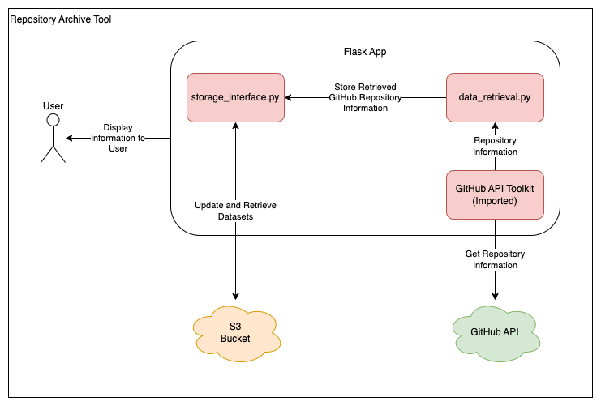

# GitHub Repository Archive Tool

## Overview

This project contains a Python Flask application which is used to archive unused GitHub repositories for an organisation. The tool interacts with the GitHub RESTful API to perform actions on an organisation's repositories.

**Please Note:** This project is a Proof of concept and may not comply with Civil Service/ONS best practices. This tool is only being used by a limited number of users.

## Techstack Overview

### Flask

[Flask](https://flask.palletsprojects.com/) is a Python web framework which can create web applications, APIs and microservices. Flask has been chosen because of its simplicity and flexibility. In addition to this, Flask is widely used across ONS and therefore has a strong support network if needed. Other web frameworks such as [Django](https://www.djangoproject.com/) were considered, however Flask was decided upon because of the project's small size and the speed at which the proof of concept needed to be developed.

## Architecture Overview



This project uses 4 major components:

- The App
- Data Retrieval
- The Storage Interface
- The GitHub API Toolkit (**stored in another repository** - [Repository Link](https://github.com/ONS-Innovation/github-api-package))

### The App

This component is responsible for the majority of the Flask App. It contains all of the routing and UI processes. It also retrieves information using the other 3 components. The App uses the data retrieval component when finding the initial list of repositories, the storage interface when reading and writing data to S3 and the GitHub API toolkit when making direct calls to the GitHub API.

### Data Retrieval

This component is used to get repository information from GitHub. The component uses the GitHub API Toolkit to make these requests. Data retrieval has 2 main processes, one for getting a list of repositories and one for contributors to a repository. Data Retrieval acts as a middle ground between `app.py` and the toolkit as the logic is too big and complex to be held around the UI and Flask functionality (increasing code readability).

### The Storage Interface

This component deals with any interaction the app has with both local and cloud storage, as well as making sure the local files match their AWS counterparts. All storage interactions the tool has works by making changes to local files, then uploading those to S3. If those local files do not exist or are outdated by another instance, they're downloaded from S3. This reduces the number of times changes are made to S3 as the local files are only uploaded once a bulk of actions has taken place (i.e when archiving repositories, instead of changing the S3 file for each repository, all changes are made locally then the S3 file is changed once).

### The GitHub API Toolkit

This component is an imported library which is shared across multiple GitHub tools. The toolkit allows applications to make authenticated requests to the GitHub API. It is imported and used in the Lambda function.

## High Level Data Overview

The app's dataset can be divided into 3 parts:

- Repositories Ready for Archive
- Archived Repositories
- Recently Added Repositories

### Repositories Ready for Archive

This section of the dataset gets stored in `repositories.json`. It contains a list of repositories which have been added to the system and are ready to be archived. Each repository within the list has the following information stored about it:

- Repository Name
- Repository Type (i.e public, private or internal)
- A list of GitHub Contributors
- The API endpoint URL for that repository
- When the repository was last committed to
- When the repository was added to the system
- An exemption date (the repository will not be archived until **after** this date)
- An exemption reason
- A Name and Email for who made the repository exempt

JSON Skeleton:

```json
[
    ...
    {
        "name": <string>,
        "type": <string>,
        "contributors": [
            ...
            {
                "avatar": <string>,
                "login": <string>,
                "url": <string>,
                "contributions": <int>
            },
            ...
        ],
        "apiUrl": <string>,
        "lastCommit": <string>,
        "dateAdded": <string>,
        "exemptUntil": <string>,
        "exemptReason": <string>,
        "exemptBy": {
            "name": <string>,
            "email": <string>
        }
    },
    ...
]
```

JSON Example:

```json
[
    ...
    {
        "name": "github-repository-archive-tool",
        "type": "public",
        "contributors": [
            ...
            {
                "avatar": "https://avatars.githubusercontent.com/u/99291477?v=4",
                "login": "TotalDwarf03",
                "url": "https://github.com/TotalDwarf03",
                "contributions": 141
            },
            {
                "avatar": "https://avatars.githubusercontent.com/u/88480716?v=4",
                "login": "gibbardsteve",
                "url": "https://github.com/gibbardsteve",
                "contributions": 15
            },
            {
                "avatar": "https://avatars.githubusercontent.com/in/29110?v=4",
                "login": "dependabot[bot]",
                "url": "https://github.com/apps/dependabot",
                "contributions": 1
            },
            ...
        ],
        "apiUrl": "https://api.github.com/repos/ONS-Innovation/github-repository-archive-tool",
        "lastCommit": "2024-07-09",
        "dateAdded": "2024-07-11",
        "exemptUntil": "1900-01-01",
        "exemptReason": "",
        "exemptBy": {
            "name": "",
            "email": ""
        }
    },
    ...
]
```

### Archive Repositories

This section of the dataset is stored in `archived.json`. It contains a list of batches of repositores which have been archived. Each batch contains the following information:

- Batch ID
- The data which the batch was archived
- A list of repositories which have been archived
    
    Each repository entry within that list contains:

    - Repository Name
    - The URL of the API endpoint for that repository
    - The archive status of that repositories (i.e Success or Failed)
    - A status message (i.e an error code and description if Failed)

JSON Skeleton:

```json
[
    ...
    {
        "batchID": <int>,
        "date": <string>,
        "repos": [
            ...
            {
                "name": <string>,
                "apiurl": <string>,
                "status": <string>,
                "message": <string>
            },
            {
                "name": <string>,
                "apiurl": <string>,
                "status": <string>,
                "message": <string>
            },
            ...
        ]
    }
    ...
]
```

JSON Example:

```json
[
    ...
    {
        "batchID": 2,
        "date": "2024-07-15",
        "repos": [
            ...
            {
                "name": "github-repository-archive-tool",
                "apiurl": "https://api.github.com/repos/ONS-Innovation/github-repository-archive-tool",
                "status": "Success",
                "message": "Repository Archived Successfully."
            },
            {
                "name": "github-policy-dashboard",
                "apiurl": "https://api.github.com/repos/ONS-Innovation/github-policy-dashboard",
                "status": "Failed",
                "message": "Error: 404 Repository not found."
            },
            ...
        ]
    }
    ...
]
```

### Recently Added Repositories

This section of the dataset gets stored in `recently_added.html`. This is a static HTML page containing a list of repositories which were most recently added to the system. Each repository has its name, a link to its GitHub page and a link to mark that repository as exempt within the tool. This file would get downloaded by the user of the tool so it can be distributed to users of ONSDigital to ensure only unused repositories are archived.

Example file:

```html
<h1>Repositories to be Archived</h1>
<ul>
    <li>github-copilot-usage-dashboard (<a href='https://github.com/ONS-Innovation/github-copilot-usage-dashboard' target='_blank'>View Repository</a> - <a href='http://localhost:5000//set_exempt_date?repoName=github-copilot-usage-dashboard' target='_blank'>Mark Repository as Exempt</a>)</li>
    <li>github-repository-archive-tool (<a href='https://github.com/ONS-Innovation/github-repository-archive-tool' target='_blank'>View Repository</a> - <a href='http://localhost:5000//set_exempt_date?repoName=github-repository-archive-tool' target='_blank'>Mark Repository as Exempt</a>)</li>
</ul>

<p>
    Total Repositories: 2
</p>
<p>
    These repositories will be archived in <b>30 days</b>, unless marked as exempt.
</p>
```

**Please Note:** The above example has been formatted manually. The contents of the real HTML file contains no whitespace, new lines or indentation.

## Getting Started

To setup and use the project, please refer to the [README](https://github.com/ONS-Innovation/github-repository-archive-tool/blob/master/README.md).